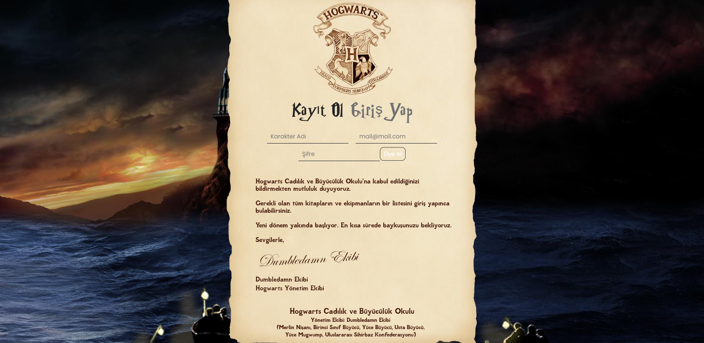
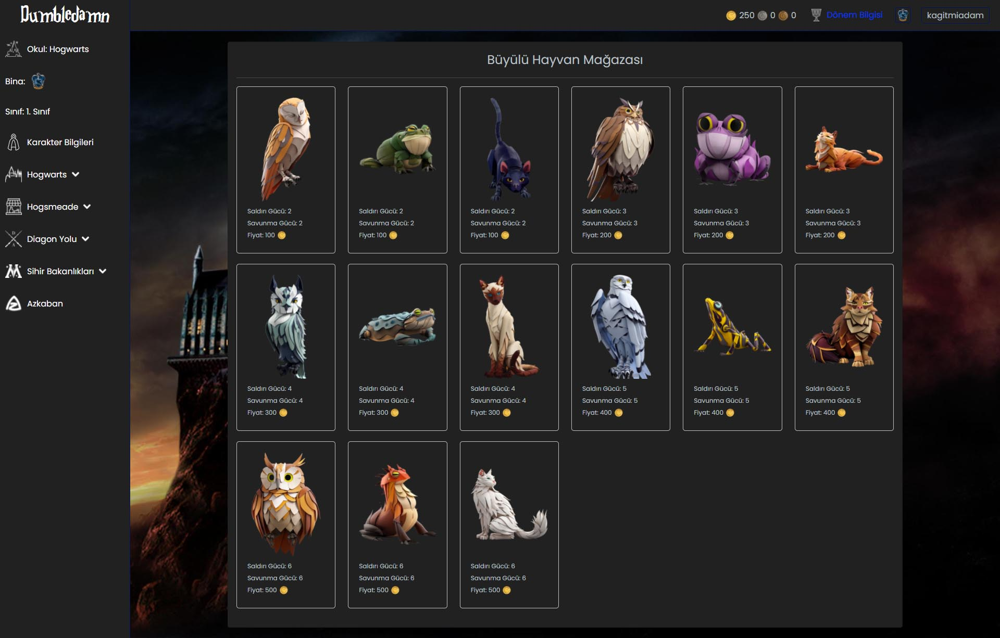
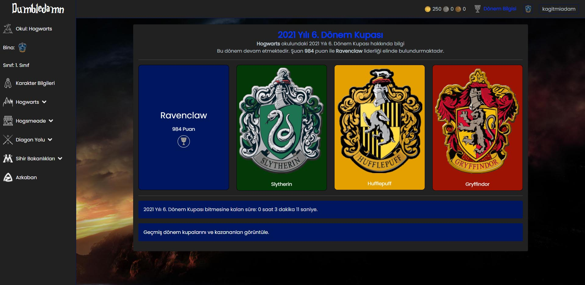

# Dumbledamn


Üç Büyücü Turnuvası - Açık Kaynak Hackathon yarışması

Harry Potter temalı bir browser RPG oyunudur.

- Asanı al
- Okulunu belirle
- Büyülerini seç
- Evcil hayvan al
- Büyü kitapları satın al
- Attack, Hp, Speed statlarını geliştir
- Okulların arasındaki savaşa katkıda bulun ve geliş








## Kurulum

### Docker Installation

docker sürümüne göre exec komutu farklılık gösterebilir. eğer app bulunamadı hatası verilir ise `docker ps` yazılıp container name alınıp öyle devam edilebilir. Bu durumda komutlar `docker-compose exec app` yerine `docker exec dumbledamn-app ...` şeklinde kullanılabilir.

```bash
docker-compose build app
docker-compose up -d
docker-compose exec app composer install
docker-compose exec app php artisan key:generate
docker-compose exec app php artisan migrate --seed
docker-compose exec app php artisan config:cache
```

### .env settings

docker kurulumu sonrası `docker-compose ps` sonucunda mysqlin namei kopyalanır.

```bash
/var/www/dumledamn$ docker-compose ps
      Name                    Command               State                  Ports                
------------------------------------------------------------------------------------------------
dumbledamn-app     docker-php-entrypoint php-fpm    Up      9000/tcp                            
dumbledamn-db      docker-entrypoint.sh mysqld      Up      3306/tcp, 33060/tcp                 
dumbledamn-nginx   /docker-entrypoint.sh ngin ...   Up      0.0.0.0:8000->80/tcp,:::8000->80/tcp
```

yukarıdaki örnekteki `dumbledamn-db` yazan yerdeki string ifade. Bu string `.env` içerisinde `DB_HOST` alanına yazılmalı.

### Çalıştırma

default olarak `http://localhost:8000/` adresinde çalışır. Eğer port doluysa docker-compose.yml dosyasından nginx 8000 portu değiştirilebilir.
